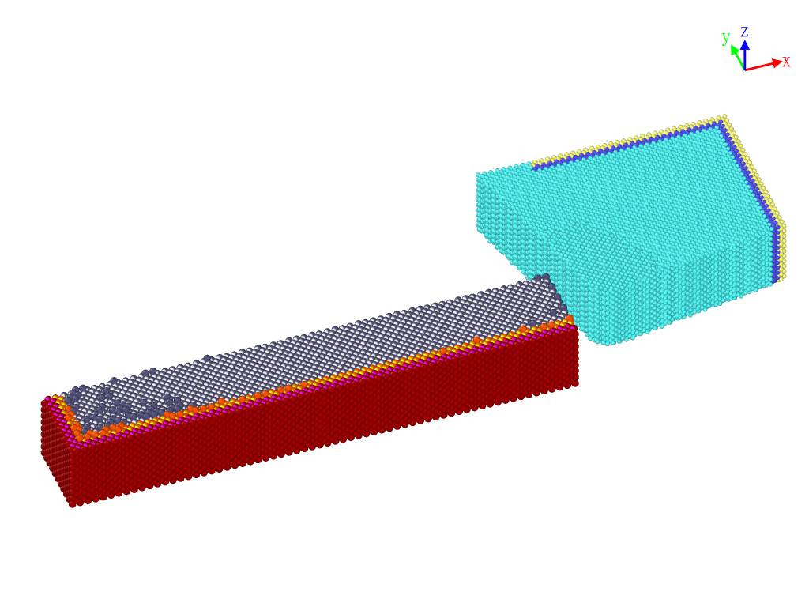

# A LAMMPS Template for Molecular Dynamics Simulation of Nanometric Cutting of 3C-SiC Against A Diamond Tool With A Rake Angle of 15° and A Clearance Angle of 10°

This repository contains a LAMMPS template for performing molecular dynamics simulation of nanometric cutting of 3C-SiC against a diamond tool with a rake angle of 15° and a clearance angle of 10°.

---

## Methodology
 
### Materials
 - single diamond tool,	with dimensions 31[100] 31[010] 22[001] in x, y, and z directions, edge radius = 4 x diamond unit cell, -15 rake angle, clearance angle = 10 degrees
 - 3C-SiC workpiece,	with dimensions 65[010] 10[010] 18[001] in x, y, and z directions
 
 

 
 
### Cutting Conditions
 - Depth of cut = 5 x 3C-SiC unit cell length
 - Cutting direction = [010]<-1 0 0> for ≈200 Å
 - Initial temperature = 300 K
 
### Simultion Settings
 1. Equilibration
 - NVT ensemble, timestep = 0.0005 ps 	(0.5 fs) for 10000 steps
 2. Cutting
 - NVT+NVE ensembles, timestep = 0.0005 ps (0.5 fs) for 400000/$v steps
 
---

## Execution

To run the simulation, you need to have LAMMPS installed on your computer. You can download LAMMPS from https://lammps.sandia.gov/.

**Input files**
 - in.cutsic_eq.lmp
 - in.cutsic_cont_201407201atomistica.lmp
 
 **Input Variables**
 - v		cutting velocity (unit = Å/ps)

 **Potential file**
 - [SiC_Erhart-Albe.tersoff](https://www.ctcms.nist.gov/potentials/entry/2005--Erhart-P-Albe-K--Si-C-I/)

To execute the simulation, you can use the following command:

```shell
# Running equilibration process
lmp_serial < in.cutsic_eq_Ltool.lmp -v v 3.0
# Running cutting procoess
lmp_serial < in.cutsic_cont_201407201atomistica.lmp  -v v 3.0
```

This will run the simulation using a single processor. If you want to use multiple processors, you need a multi-core workstation with an LAMMPS MPI executable installed and you use the following command:

```shell
# Running equilibration process
mpirun -np N lmp_mpi < in.cutsic_eq.lmp -v v 3.0
# Running cutting procoess
mpirun -np N lmp_mpi < in.cutsic_cont_201407201atomistica.lmp  -v v 3.0
```

where N is the number of processors you want to use.

The simulation will output several files with different extensions, such as `.log`, `.lammpstrj`, `.restart`, etc. You can use these files to analyze the results of the simulation using various tools, such as OVITO, LAMMPS Pizza.py, Paraview, etc.
 
## Citations and References

- If you utilize the materials in this repository, please cite the following paper:

  [**Fung, K. Y., Tang, C. Y., & Cheung, C. F.** (2017). Molecular dynamics analysis of the effect of surface flaws of diamond tools on tool wear in nanometric cutting. *Computational Materials Science, 133*, 60-70.](https://doi.org/10.1016/j.commatsci.2017.03.006)

- If you work with earlier versions of LAMMPS, please reference:

  [**Plimpton, S.** (1995). Fast Parallel Algorithms for Short-Range Molecular Dynamics. *Journal of Computational Physics, 117*, 1-19.](https://doi.org/10.1006/jcph.1995.1039)

  For further details and citations for later versions of LAMMPS, please refer to the [LAMMPS citation guidelines](https://www.lammps.org/cite.html).

- If you publish results obtained using OVITO, please cite the following software in your publication:

  [**Stukowski, A.** (2010). Visualization and analysis of atomistic simulation data with OVITO - the Open Visualization Tool. *Modelling and Simulation in Materials Science and Engineering, 18*, 015012.](https://doi.org/10.1088/0965-0393/18/1/015012)

  For additional information, please refer to the [OVITO citation guidelines](https://www.ovito.org/#citeOvito).
  
- For the atomic potential utilized in the MD simulations, please reference:

  [**Erhart, P., & Albe, K.** (2005). Analytical potential for atomistic simulations of silicon, carbon, and silicon carbide. *Physical Review B, 71*(3), 035211.](https://doi.org/10.1103/physrevb.71.035211)
